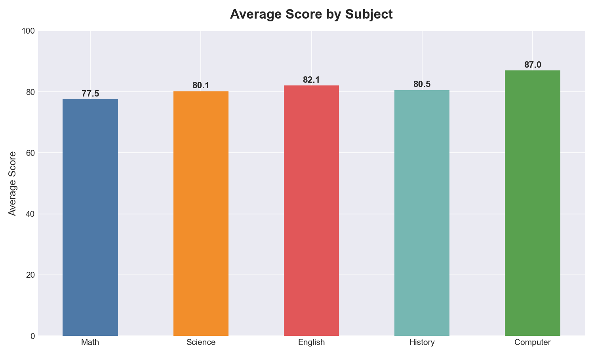
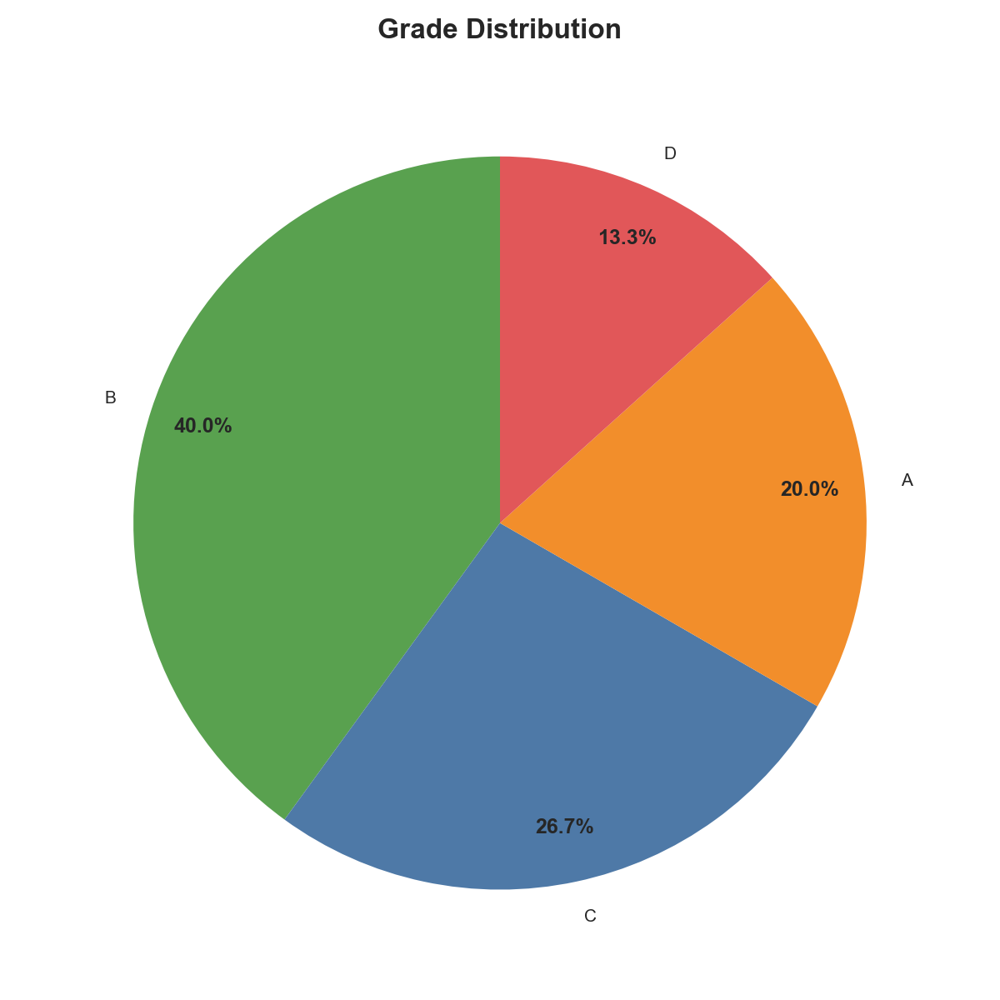
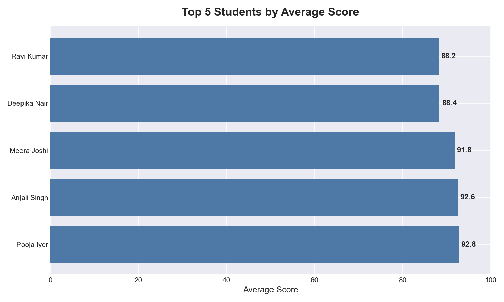

# 📊 Student Score Analysis

A data analysis project using Python and Pandas to analyze student performance across multiple subjects.

## 🔍 What This Project Does

- Loads and cleans student score data from CSV
- Calculates average scores per student and per subject
- Assigns grades (A/B/C/D/F) based on performance
- Identifies top performing students
- Generates visualizations using Matplotlib

## 📈 Key Findings

- **Class Average:** 81.45
- **Top Student:** Pooja Iyer (92.8 average)
- **Best Subject:** Computer Science (87.0 avg)
- **Most students** scored a B grade (6 out of 15)

## 📊 Charts

### Average Score by Subject

### Grade Distribution

### Top 5 Students

## 🛠️ Tools Used

- Python 3.13
- Pandas — data loading and analysis
- Matplotlib — data visualization
- CSV — data storage

## 🚀 How to Run

1. Clone this repo
2. Install requirements:
